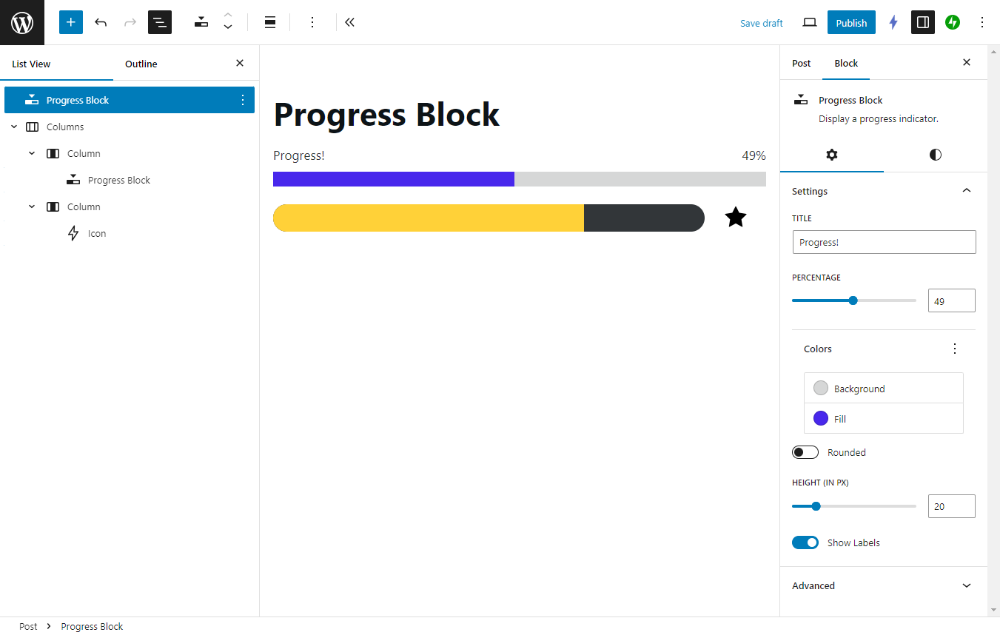

# Progress Block

With this **Progress Block**, you can easily show your audience your progress! Use this plugin directly in the WordPress block editor and showcase your important statistics, data, achievements, and more.

## Settings

- **Title**: Set a custom heading for your progress bar.
- **Percentage**: Set the progress with a slider, or set the number directly.
- **Colors**: Set the colors for the background and fill. Supports your theme's colors!
- **Rounded**: Turn on to give your progress bar rounded corners. Turn off to be square.
- **Height**: Set the height of your progress bar, in pixels.
- **Show Labels**: Turn on to display the title and percentage number. Turn off to hide them.
- Progress Block also supports additional style settings:
  - Text and background color (not to be confused with the progress bar's background color)
  - Font size
  - Padding and margin

## Installation

1. Download the latest version from `https://github.com/peiche/ankur/releases`.
2. In your WordPress Dashboard, navigate to Plugins > Add New Plugin.
3. Click Upload Plugin. Choose the `progress-block.zip` file. Click Install Now.
4. Activate the plugin.
5. The Progress Block plugin is now ready to use!

## Running locally

1. Download the code or clone the repository into a local instance of WordPress. (I use [Local](https://localwp.com/).)
2. In the root level of the plugin, run `npm install`.
3. Run `npm run start` or `npm run build`.
4. Activate the plugin.

## Change log

See the [change log](./CHANGELOG.MD).
